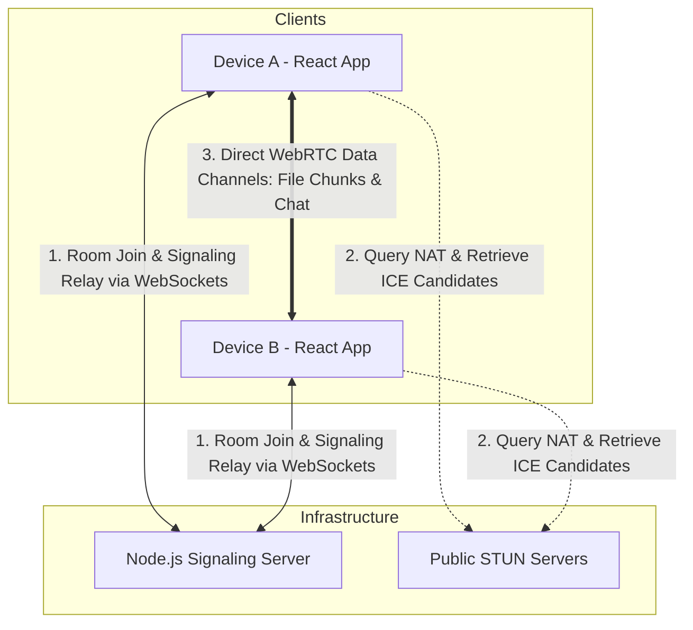
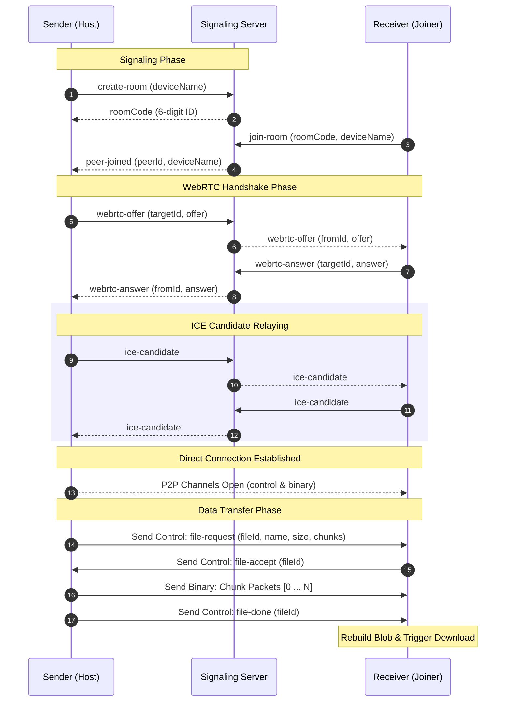

# PeerDrop

PeerDrop is a browser-based peer-to-peer (P2P) file sharing and real-time communication application. It enables direct, secure device-to-device transfers without intermediary cloud storage, utilizing WebRTC for data transport and Socket.IO for signaling.

---

## 1. Project Title and Overview

PeerDrop is a decentralized web application designed to allow users to securely transfer files, synchronize clipboards, and exchange instant text messages directly between devices. 

Key technical aspects include:
- **Signaling Layer**: A lightweight Node.js/Express.js backend utilizing Socket.IO to coordinate room coordination, peer discovery, and initial WebRTC handshakes.
- **Data Transfer Layer**: Native HTML5 WebRTC (`RTCPeerConnection` and `RTCDataChannel`) establishing direct, encrypted, browser-to-browser tunnels.
- **Client Application**: An interactive React single-page application built on Vite, styled with Tailwind CSS, and managed locally using in-memory state.

---

## 2. Problem Statement

Traditional file sharing between nearby or cross-platform devices introduces friction:
- **Intermediate Storage Overhead**: Services like email, cloud storage (Google Drive, Dropbox), or chat platforms require uploading files to remote servers, consuming cloud storage, introducing privacy concerns, and duplicating network bandwidth (upload to cloud, download to target).
- **Setup Complexity**: Local wireless transfer tools often require OS-specific setups, native application installations, matching user accounts, or physical cables.
- **Platform Locks**: Shared clipboard tools and native P2P protocols (like AirDrop or Quick Share) are restricted to single ecosystems (Apple or Android/Windows).

PeerDrop solves this by providing an ecosystem-agnostic, zero-install, serverless-storage web application. Devices connect via temporary web sockets and transfer files directly over local or wide-area networks using encrypted peer-to-peer data channels.

---

## 3. Key Features

- **Direct P2P File Sharing**: Direct browser-to-browser file transfers of any size/type. File content never touches the backend server.
- **Dual Data-Channel Architecture**:
  - `control`: Used for negotiation (metadata, accept/reject prompts, transmission completion triggers), clipboard sharing, and text chat.
  - `binary`: Dedicated exclusively to high-throughput file chunk delivery.
- **Room-Based Pairing**:
  - **6-Digit Codes**: Simple 6-digit codes generated by the signaling server.
  - **QR Code Scanning**: QR codes containing join URLs can be displayed on-screen and scanned using camera streams decoded client-side via the browser's MediaDevices API and `jsqr`.
- **Drag-and-Drop / Folder Support**: Supports dragging files into a drop zone or selecting entire directories using the HTML5 File System Directory API.
- **Transfer Pacing & Progress Tracking**: Real-time progress bars showing sending/receiving percentages, with memory-safe buffer pacing.
- **Instant Clipboard & Text Chat**: Real-time sharing of snippets, links, and text messages alongside active transfers.
- **Dynamic Theme Mode**: Smooth dark and light mode rendering using Tailwind CSS classes.

---

## 4. Technology Stack

| Layer | Technology | Purpose |
|-------|------------|---------|
| **Frontend UI** | React.js (v19), Tailwind CSS | Single-page responsive interface and interactive components. |
| **Frontend Build Tool** | Vite | Module bundler, hot module reloading, and packaging. |
| **Signaling Protocol** | Socket.IO Client | WebSocket wrapper used to coordinate peer handshakes. |
| **Real-time WebRTC** | Native browser API | Standard client-side connection (`RTCPeerConnection`, `RTCDataChannel`) used to establish P2P communication. *(Note: simple-peer is declared as a package.json dependency but the app directly uses native browser APIs).* |
| **QR Code Encoding** | `qrcode.react` | Renders rooms as SVG-based QR codes in the UI. |
| **QR Code Decoding** | `jsqr` | Processes video frames in canvas to extract and parse room invite codes from client camera streams. |
| **Backend Framework** | Node.js, Express.js | Core server hosting middleware, static routing, and health checks. |
| **Signaling Engine** | Socket.IO | Manages room state maps and relays signaling SDP offers, answers, and ICE candidates between clients. |

---

## 5. System Architecture

PeerDrop separates the **Control/Signaling Path** from the **Data Path**. File contents are transmitted directly browser-to-browser and never travel through the Node.js signaling server.



- **Signaling Path (WebSocket)**: Handled by Socket.IO over HTTP/WS. Devices register themselves in a room and exchange WebRTC session descriptors (SDP) and ICE candidates.
- **Media/Data Path (WebRTC)**: Established directly between Device A and Device B. Once connected, the WebSocket signaling connection becomes idle, and file data flows entirely through local network routers or NAT translation paths.

---

## 6. How Peer-to-Peer Connection Works

1. **Host Setup**:
   - Device A enters a name and initiates **Create Room**. It opens a Socket.IO connection and registers room creation.
   - The server responds with a unique 6-digit room code and holds a room map index in memory.
2. **Peer Connection Request**:
   - Device B scans the host's QR code or enters the 6-digit code. It joins the socket room on the signaling server.
   - The signaling server notifies the host (`Device A`) that a peer has joined (`peer-joined`).
3. **WebRTC Negotiation (SDP Exchange)**:
   - Device A instantiates an `RTCPeerConnection` with configured public Google STUN servers.
   - Device A creates two `RTCDataChannel` streams (`control` and `binary`) and generates a WebRTC connection Offer.
   - Device A sets the offer as its local description and emits `webrtc-offer` to the signaling server, which forwards it to Device B.
   - Device B receives the offer, creates its own `RTCPeerConnection`, registers handlers for incoming data channels (`ondatachannel`), sets the remote description, generates a WebRTC Answer, and sends it back to Device A.
4. **ICE Candidate Gathering & Traversal**:
   - Both peers query configured STUN servers to discover their public-facing IP addresses and ports (ICE Candidates).
   - Candidates are relayed via the server's `ice-candidate` sockets and applied using `.addIceCandidate()`.
5. **Data Channel Handshake**:
   - The peers establish a direct P2P connection. Data channels shift to the `open` state, triggering UI connection indicators.

---

## 7. Signaling Architecture

The signaling server (`backend/server.js` and `backend/socket/socketHandler.js`) manages rooms in-memory using a Map object (`backend/utils/roomManager.js`).

### Socket.IO Event Mappings

| Socket Event (Client to Server) | Direction | Purpose |
|---------------------------------|-----------|---------|
| `create-room` | Outgoing | Registers host connection and allocates a random 6-digit room code. |
| `join-room` | Outgoing | Registers joiner connection to the matching room code; returns host details. |
| `webrtc-offer` | Outgoing | Relays SDP connection offer to a target peer socket ID. |
| `webrtc-answer` | Outgoing | Relays SDP connection answer to the host peer socket ID. |
| `ice-candidate` | Outgoing | Relays gathered network traversal candidate to the remote peer. |
| `leave-room` | Outgoing | Manually triggers disconnection and cleanup of active rooms. |
| `disconnect` | Outgoing | Native socket lifecycle trigger; handles unexpected room cleanups. |

| Socket Event (Server to Client) | Direction | Purpose |
|---------------------------------|-----------|---------|
| `peer-joined` | Incoming | Notifies host that the guest peer connected; triggers host SDP negotiation. |
| `webrtc-offer` | Incoming | Delivers WebRTC offer SDP to the joiner peer. |
| `webrtc-answer` | Incoming | Delivers WebRTC answer SDP to the host peer. |
| `ice-candidate` | Incoming | Delivers target candidate to add to the active peer connection. |
| `peer-disconnected` | Incoming | Notifies active peer that connection broke; resets client UI to idle state. |

---

## 8. File Transfer Architecture

To transfer files reliably and prevent browser memory crashes, PeerDrop implements a chunking and flow-control pipeline over standard `RTCDataChannel` sockets.

```
[Selected File]
       │
       ▼
[Slice file into 64KB Chunks]
       │
       ▼
[Format Binary Packet: 4B FileID + 4B ChunkIndex + Payload]
       │
       ▼
[Send to binary channel] ──(Buffer > 1MB?) ──► [Pause and wait for low threshold]
       │
       ▼
[Receiver receives ArrayBuffer]
       │
       ▼
[Store at correct index in Array]
       │
       ▼
[File-Done Received?] ──► [Combine chunks into Blob] ──► [Initiate Browser Download]
```

### Protocol Specifications
- **Chunk Size**: `65536` bytes (64KB).
- **Serialization Format**: Chunks are sent as binary `ArrayBuffer` packets formatted as follows:
  - **Bytes 0 - 3 (Uint32, Little Endian)**: Unique file identifier (`fileId`).
  - **Bytes 4 - 7 (Uint32, Little Endian)**: Chunk sequence index (`chunkIndex`).
  - **Bytes 8+ (Binary)**: Raw file segment payload.
- **Pacing & Flow Control**:
  To prevent browser crashes on large transfers, the sending loop monitors `binaryCh.current.bufferedAmount`. If the buffered amount exceeds **1MB (1,048,576 bytes)**, the loop pauses execution. It resumes only after receiving the data channel's `bufferedamountlow` event (set at a `65536` byte threshold).
- **Assembly**:
  The receiving browser pre-allocates an array of chunks based on the expected counts shared in the control channel metadata. As chunks arrive, they are stored at their index. Once all chunks are received and a `file-done` control message is decoded, the array is compiled into a single `Blob` and exported to a virtual object URL for browser download.

---

## 9. WebRTC Architecture

- **Connections**: Native client-side `RTCPeerConnection` instance.
- **STUN Infrastructure**: Uses Google's public STUN servers to resolve connection variables through symmetric/cone NAT configurations:
  - `stun:stun.l.google.com:19302`
  - `stun:stun1.l.google.com:19302`
- **Data Channels**:
  - **`control`**: Renders text messages and control payload packets (JSON stringified).
  - **`binary`**: Configured for high-performance `arraybuffer` payload parsing.
- **Tunnels**: Encrypted by default at the transport layer using DTLS (Datagram Transport Layer Security) negotiated natively during the WebRTC handshake.

---

## 10. End-to-End Data Flow



---

## 11. Project Folder Structure

```
PeerDrop/
├── backend/
│   ├── config/
│   │   └── corsConfig.js
│   ├── socket/
│   │   └── socketHandler.js
│   ├── utils/
│   │   └── roomManager.js
│   ├── .env
│   ├── package.json
│   └── server.js
├── frontend/
│   ├── public/
│   │   └── favicon.svg
│   ├── src/
│   │   ├── components/
│   │   │   ├── ClipboardPanel.jsx
│   │   │   ├── ConnectedDevices.jsx
│   │   │   ├── FilePreviewModal.jsx
│   │   │   ├── FileSharePanel.jsx
│   │   │   ├── Navbar.jsx
│   │   │   ├── QRScanner.jsx
│   │   │   ├── RoomPanel.jsx
│   │   │   ├── TextChatPanel.jsx
│   │   │   └── TransferHistory.jsx
│   │   ├── context/
│   │   │   ├── PeerContext.jsx
│   │   │   └── ThemeContext.jsx
│   │   ├── hooks/
│   │   │   ├── useHistory.js
│   │   │   └── useNotifications.js
│   │   ├── pages/
│   │   │   ├── Dashboard.jsx
│   │   │   └── Landing.jsx
│   │   ├── services/
│   │   │   └── socket.js
│   │   ├── utils/
│   │   │   ├── fileUtils.js
│   │   │   └── roomUtils.js
│   │   ├── App.jsx
│   │   ├── index.css
│   │   └── main.jsx
│   ├── .env
│   ├── eslint.config.js
│   ├── index.html
│   ├── package.json
│   ├── postcss.config.js
│   ├── tailwind.config.js
│   └── vite.config.js
└── README.md
```

---

## 12. Local Installation and Setup

### Prerequisites
- **Node.js**: Version 18.0.0 or higher.
- **npm**: Version 9.0.0 or higher.

### Step 1: Clone the Repository
```bash
git clone https://github.com/your-username/PeerDrop.git
cd PeerDrop
```

### Step 2: Set Up Backend Server
1. Navigate to the backend folder:
   ```bash
   cd backend
   ```
2. Install dependencies:
   ```bash
   npm install
   ```
3. Set up environment configuration:
   Create a `.env` file in the `backend` folder:
   ```env
   PORT=2569
   ALLOWED_ORIGINS=http://localhost:5173
   NODE_ENV=development
   ```
4. Start backend in development mode (using nodemon):
   ```bash
   npm run dev
   ```

### Step 3: Set Up Frontend Client
1. Open a new terminal and navigate to the frontend folder:
   ```bash
   cd ../frontend
   ```
2. Install dependencies:
   ```bash
   npm install
   ```
3. Configure the socket connection:
   Create a `.env` file in the `frontend` folder:
   ```env
   VITE_SOCKET_URL=http://localhost:2569
   ```
4. Start the frontend developer server:
   ```bash
   npm run dev
   ```
5. Open your browser and navigate to the local URL (typically `http://localhost:5173`).

